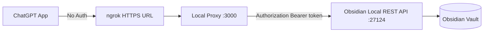

# ChatGPT Obsidian MCP Proxy

A small local proxy that lets ChatGPT reach the Obsidian Local REST API MCP endpoint through a public HTTPS tunnel such as ngrok.

The proxy keeps your Obsidian API key on your machine. ChatGPT connects with **No Auth**, and this server adds the required `Authorization: Bearer ...` header before forwarding requests to Obsidian.

## Architecture



## Requirements

- Obsidian
- Obsidian Local REST API community plugin
- Node.js LTS
- ngrok or another HTTPS tunnel

## Setup

Install dependencies:

```powershell
npm install
```

Create your local environment file:

```powershell
Copy-Item .env.example .env
```

Edit `.env` and set:

```text
OBSIDIAN_API_KEY=your_local_rest_api_key
```

Do not commit `.env`. It contains the secret token for your vault.

## Run

Start Obsidian and confirm the Local REST API plugin is enabled.

Start the proxy:

```powershell
npm start
```

Expected output:

```text
Obsidian MCP proxy running on http://127.0.0.1:3000
Forwarding to https://127.0.0.1:27124
```

Test the proxy:

```powershell
curl.exe http://127.0.0.1:3000/
```

The response should include:

```json
"authenticated": true
```

Start ngrok:

```powershell
ngrok http http://127.0.0.1:3000
```

Copy the HTTPS forwarding URL. Your ChatGPT MCP server URL is:

```text
https://YOUR-NGROK-URL.ngrok-free.app/mcp/
```

Always include `/mcp/` at the end.

## ChatGPT App Configuration

Use these settings in ChatGPT Developer Mode:

| Field | Value |
|---|---|
| Name | `Obsidian Notes` |
| Description | `Search, read, create, and append notes in my Obsidian vault.` |
| Connection | `Server URL` |
| Server URL | `https://YOUR-NGROK-URL.ngrok-free.app/mcp/` |
| Authentication | `No Auth` |

## Useful Checks

Test Obsidian directly:

```powershell
curl.exe -k https://127.0.0.1:27124/
```

Test MCP through the proxy:

```powershell
curl.exe http://127.0.0.1:3000/mcp/ -H "Accept: text/event-stream"
```

If the connection stays open or streams events, that is expected for MCP.

## Security Notes

- Treat the ngrok URL like a temporary doorway into your vault.
- Do not share the ngrok URL.
- Stop ngrok when you are done.
- Stop this proxy when you are done.
- Never commit `.env`.
- Avoid exposing this permanently without stronger authentication.

## Troubleshooting

See [docs/runbook.md](docs/runbook.md) for the full setup runbook, validation flow, and common fixes.
